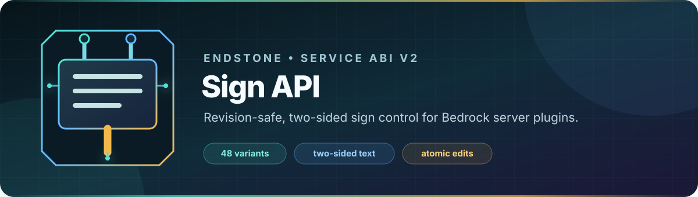
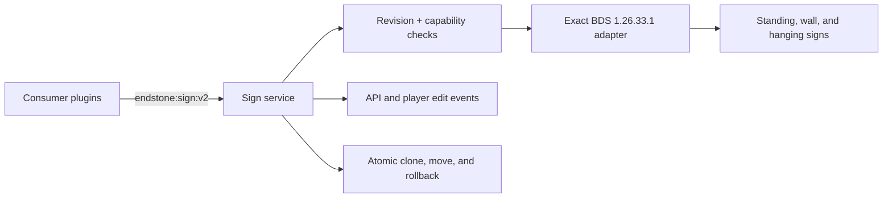

<p align="center">
  
</p>

<p align="center">
  <a href="https://github.com/TheNINJALLO/endstone-sign-api/actions/workflows/ci.yml"></a>
  <a href="https://github.com/TheNINJALLO/endstone-sign-api/actions/runs/30707456488"></a>
  <a href="LICENSE"></a>
</p>

<p align="center">
  
  
  
  
  
  
</p>

<p align="center">
  <strong>One service for every Bedrock sign.</strong><br>
  Capture, place, edit, mirror, move, lock, and persist standing, wall, and
  hanging signs through a revision-safe native API.
</p>

<p align="center">
  <a href="#-install-the-linux-qualification-candidate">Install</a> •
  <a href="#-one-run-release-qualification">Run the release test</a> •
  <a href="#-c-plugin-integration">Integrate a plugin</a> •
  <a href="docs/API.md">API reference</a> •
  <a href="examples/cpp/plugin_integration_examples.cpp">Examples</a>
</p>

> [!IMPORTANT]
> `v0.2.1-alpha.2` is the final Linux x86-64 qualification candidate for exact
> BDS package `1.26.33.1`, runtime `26.33`, and Endstone `0.11.6`. Use a
> backed-up disposable world for the combined release test before production.

## ✨ Overview

Endstone Sign API publishes `endstone:sign:v2`, a typed C++ service for plugins
that need safe, interoperable control over every native sign layer without
shipping their own private Bedrock hooks.

| Capability | What it provides |
|---|---|
| Complete sign lifecycle | Capture, place, replace, remove, clone, and move |
| Every sign form | 12 material families across standing, wall, ceiling-hanging, and wall-hanging forms |
| Two-sided text | Front/back messages, individual lines, filtered text, and Bedrock `rawtext` objects |
| Native presentation | ARGB color, glow, hidden glow outline, formatting persistence, and wax state |
| Editor integration | Native locking, front/back editor opening, and cancellable player-edit events |
| Conflict safety | Optimistic revisions, exact readback, atomic transactions, and rollback |
| Plugin interoperability | Stable service ABI, typed events, capability discovery, and client updates |
| Release qualification | One 48-case matrix plus all server, client, reconnect, restart, and cleanup evidence |



## 📚 Documentation

| Guide | Purpose |
|---|---|
| [API reference](docs/API.md) | Public types, service calls, events, capabilities, and result contracts |
| [Architecture](docs/ARCHITECTURE.md) | Portable core, service boundary, native adapter, and transaction design |
| [Placement](docs/PLACEMENT.md) | Canonical identifiers and typed standing, wall, and hanging states |
| [Exact build](docs/BUILD_EXACT.md) | Reproducible BDS/Endstone build and packaging requirements |
| [Stage probe](docs/STAGE_PROBE.md) | Disposable-world qualification process and evidence model |
| [Symbol audit](docs/SYMBOL_AUDIT.md) | Exact native boundaries, fingerprints, and representation review |
| [Plugin examples](examples/cpp/plugin_integration_examples.cpp) | Chest shop, Discord bridge, and moving-message integrations |

## 🚦 Candidate status

Version 0.2.1-alpha.2 is the single full-system Linux x64 qualification
candidate that follows stable v0.2.0. It registers `endstone:sign:v2` ABI 2 on
exact BDS `1.26.33.1` with Endstone `0.11.6` and exposes every native layer at
once: structure, both text sides, Bedrock raw-text objects, color/glow, wax,
editor lock/opening, API/player edit events, client updates, and persistence
coverage. Each mutation still uses a fresh revision, native readback, client
update, and rollback where applicable.

The alpha.1 Linux report passed all 48 material/form cases and proved the
TextObject mutation and canonical readback. It also exposed a tester cleanup
defect: disabling object mode retained the rendered `a7` lines, so the source
revision no longer matched and the next 11 probes failed in sequence. Alpha.2
restores those original lines explicitly before continuing, without bypassing
revision, ownership, readback, cleanup, or evidence checks.

The adapter loads only when the running `bedrock_server` matches the pinned
Linux executable SHA-256
`61995841f21baf9bfab96e0d9b0cb798501dcc9789dab68e496f3b8e3bc83375`
and the required function, vtable, representation, and ABI fingerprints match.
Consumers must require `capabilities().supportedRelease()` and every capability
they use. All pre-stage native capabilities are open in this candidate so
`/signprobe accept` can test every layer in one run. `stage_probe_passed` and
`completeControl()` intentionally remain false until the Linux matrix, client
checkpoints, restart evidence, log, and world backup pass validation.

## 📦 Install the Linux qualification candidate

The exact Linux build, asset verification, wheel smoke test, and downstream
command tests passed in [GitHub Actions run `30725337982`](https://github.com/TheNINJALLO/endstone-sign-api/actions/runs/30725337982).
Download the tagged prerelease and verify its platform checksums:

| Deliverable | Verified filename |
|---|---|
| Complete Linux SDK package | `endstone-sign-api-v0.2.1-alpha.2-bds-1.26.33-linux-x64.zip` |
| Native Endstone plugin | `endstone_sign_bds_1_26_33.so` |
| CPython 3.14 qualification plugin | `endstone_sign_tester-0.2.1a2-cp314-cp314-linux_x86_64.whl` |
| SHA-256 manifest | `endstone-sign-api-v0.2.1-alpha.2-bds-1.26.33-linux-x64.sha256` |

```bash
gh release download v0.2.1-alpha.2 \
  --repo TheNINJALLO/endstone-sign-api \
  --dir sign-api-0.2.1-alpha.2
cd sign-api-0.2.1-alpha.2
sha256sum --check endstone-sign-api-v0.2.1-alpha.2-bds-1.26.33-linux-x64.sha256
```

Stop the test server, install the matching native plugin and CPython 3.14 tester
wheel together, and start it through
[Endstone `0.11.6`](https://endstone.dev/v0.11/getting-started/start-your-server/)
from the server root:

```bash
SERVER_ROOT=/srv/endstone
install -D -m 0644 endstone_sign_bds_1_26_33.so \
  "$SERVER_ROOT/plugins/endstone_sign_bds_1_26_33.so"
install -D -m 0644 \
  endstone_sign_tester-0.2.1a2-cp314-cp314-linux_x86_64.whl \
  "$SERVER_ROOT/plugins/endstone_sign_tester-0.2.1a2-cp314-cp314-linux_x86_64.whl"
cd "$SERVER_ROOT"
endstone 2>&1 | tee acceptance-server.log
```

## 🧪 One-run release qualification

Run these commands as an operator/player in a clear arena. The anchor and the
entire default 28-by-17-block footprint must be air:

```text
/signprobe status
/signprobe accept 100 64 100 confirm
/signprobe runstatus
```

`status` must identify `bds-1.26.33.1-linux-release`, `supported_release` must
be true, and every capability except `stage_probe_passed` must be true. The
acceptance command runs all 48 material/form cases and every automated native
probe before pausing for the seven explicit client/operator checkpoints below.
A failure stops qualification and is repaired before release activation.

After the automated work reports that guided evidence remains, perform and
record the seven client/operator checkpoints. Replace the example evidence with
specific coordinates, observed values, timestamps, and bounded log references:

```text
/signprobe editor front
/signprobe record open_editor_front true Front editor opened for the retained sign at <coordinates>; observed <time/log reference>
/signprobe editor back
/signprobe record open_editor_back true Back editor opened for the retained sign at <coordinates>; observed <time/log reference>
/signprobe record player_edit_event_observed true Client edit produced the expected event at <coordinates>; log <reference>
/signprobe record player_edit_event_cancelled true Cancelled client edit left both sides and revision unchanged; log <reference>
/signprobe record client_refresh true Connected client immediately displayed the verified front and back values at <coordinates>
/signprobe record player_reconnect true After reconnect the client and capture returned the same verified values and revision
/signprobe record server_restart_persistence true After a full stop/start the client and capture returned the same verified values and revision
```

Run ownership-aware cleanup after the reconnect and restart checks. Do not run
`/signprobe remove` on the retained sign; successful cleanup supplies the
required `remove` evidence automatically.

```text
/signprobe cleanup confirm
/signprobe runstatus
/signprobe path
```

Stop the server cleanly, preserve an immutable copy of its final log, and make a
post-cleanup backup of the tested world. Hash those exact two files. Restart the
same server only to paste the two lowercase hashes and finish the report; the
validator must receive the immutable files that produced those hashes.

```bash
sha256sum acceptance-server.evidence.log post-cleanup-world-backup.zip
```

```text
/signprobe meta log_sha256 <acceptance-server.evidence.log-sha256>
/signprobe meta world_backup_sha256 <post-cleanup-world-backup.zip-sha256>
/signprobe finish
/signprobe runstatus
/signprobe path
```

Copy the two report paths printed by `/signprobe path` and validate the reports
against the exact five artifacts used by that run:

```bash
python tools/validate_full_system_acceptance.py \
  latest-matrix-report.json linux-x64-1.26.33.1-stage-probe.json \
  --server-executable ./bedrock_server \
  --plugin-binary plugins/endstone_sign_bds_1_26_33.so \
  --tester-wheel plugins/endstone_sign_tester-0.2.1a2-cp314-cp314-linux_x86_64.whl \
  --server-log acceptance-server.evidence.log \
  --world-backup post-cleanup-world-backup.zip
```

The complete-control validator passes only when its final line is
`full-system acceptance VALID`. It
requires 48/48 cases, 31/31 probes, zero failed/skipped/manual coverage, every
pre-stage native capability, matching run/config/world/binary identity, and
conflict-free cleanup. The seven guided results are operator attestations, so a
release reviewer must also inspect their notes and bound log/backup rather than
treating non-empty text as independent client proof.

This candidate is Linux x64 only and makes no Windows native support claim.
The strict result is the release gate for promoting these capabilities into
the next stable version.

The supported-scope diagnostic matrix remains available:

```text
/signprobe run 100 64 100 confirm
```

The anchor and every planned sign/support cell must be air. The runner creates
solid fixture supports through Endstone's public block API, places blank signs
through `endstone:sign:v2`, then verifies structural capture, front/back raw
text, opposite-side preservation, and an individual-line change one operation
per scheduled tick. Its default text includes raw `§` color codes while staying
inside the exact 22-byte limit. Run `/signprobe config` to print the generated
`matrix-config.toml` path in the tester's plugin data directory, then edit it to
select materials, forms, text, spacing, ARGB, glow, wax, cleanup, and scheduling
behavior.

Filtered text, raw-text objects, owner data, color, glow, wax,
outline/formatting flags, editor locking/opening, player/API edit events,
clone, move, and atomic operations are all available to the strict candidate
run. Client rendering, editor UI acknowledgement, player edits, reconnect, and
restart persistence remain explicit manual checkpoints, so automation alone
cannot claim activation eligibility.

The candidate registers the full native surface of `endstone:sign:v2`;
`supportedRelease()` is true and `completeControl()` remains false only because
the evidence gate has not yet been embedded. Activation requires all of these
simultaneously:

1. The runtime is BDS `26.33` with Endstone `0.11.6`.
2. The running executable SHA-256 matches a reviewed platform manifest for official package `1.26.33.1`.
3. Every required native symbol has an exact RVA, fingerprint, signature review, and behavior review.
4. The player-edit hook is cancellable before the game mutates the sign.
5. A reviewed native bridge source matches its recorded SHA-256.
6. Every disposable-world stage probe passes, including client refresh, reconnect, restart persistence, and rollback.

Activation also requires the reviewed manifest to reference SHA-256-bound stage
and matrix reports. The verifier parses both reports and binds their platform,
executable, artifacts, run, configuration, world, target, exact 31-probe
coverage, and successful qualification verdict; copied pass booleans in the
manifest cannot substitute for those reports.

All advanced operations are exposed by this exact-Linux candidate. The verified
generated manifest and `completeControl()` stay closed until the combined run is
reviewed; the tester still checks every mutation capability and fails the run if
the candidate unexpectedly closes one.

## 🎯 Full-control contract

The API contract includes:

- Capture every sign property and both sides.
- Place every wood/material variant in standing, wall, ceiling-hanging, and wall-hanging forms.
- Replace a sign while preserving an explicit conflict policy.
- Remove a sign with optional item drop behavior.
- Clone or atomically move a sign.
- Edit all four lines individually or replace a complete message.
- Read and write front and back text independently.
- Read and write filtered text, text-object JSON, text ownership XUID, ARGB color, glow, hidden glow outline, and formatting persistence.
- Wax and unwax signs.
- Lock and unlock the native editor.
- Open the native front- or back-side editor for a player.
- Observe and cancel API edits and player edits.
- Use optimistic revisions to reject stale writes.
- Apply multi-sign changes atomically with rollback.
- Force a client block-actor refresh and require restart persistence in the native acceptance gate.

## 🧱 Placement helpers

The API never makes plugin authors guess raw block-state values.

```python
from endstone_sign import (
    SignKind,
    SignLocation,
    SignMaterial,
    SignPlaceRequest,
    SignService,
    SignText,
    make_ceiling_hanging_sign_states,
    sign_block_identifier,
)

request = SignPlaceRequest(
    location=SignLocation("overworld", 100, 70, 100),
    block_identifier=sign_block_identifier(
        SignMaterial.CHERRY,
        SignKind.CEILING_HANGING,
    ),
    states=make_ceiling_hanging_sign_states(rotation=8, chains_attached=True),
    front=SignText(lines=("The Kingdom", "Market", "", ""), glowing=True),
    back=SignText(lines=("Staff Only", "", "", "")),
)

result = service.place(request)
```

Oak standing and wall signs use Bedrock's generic `minecraft:standing_sign` and `minecraft:wall_sign` block IDs. Other materials use material-specific standing and wall IDs. Hanging signs use the material-specific `_hanging_sign` ID and the typed hanging-state helpers.

## ✍️ Editing and revision protection

```python
from endstone_sign import SignPatch, SignTextPatch

snapshot = service.capture(location)
assert snapshot is not None

result = service.apply(SignPatch(
    location=location,
    expected_revision=snapshot.revision,
    front=SignTextPatch(
        line_updates={1: "Open 24/7"},
        argb=0xFFFFAA00,
        glowing=True,
    ),
    back=SignTextPatch(message="Authorized\nPersonnel"),
    waxed=True,
))
```

A stale `expected_revision` returns `conflict`; it never silently overwrites a newer edit.

## 🔁 Atomic transactions

```python
from endstone_sign import SignPatch, SignTransaction

result = service.transact(SignTransaction(
    operations=(
        SignPatch(location=left, expected_revision=left_revision, waxed=True),
        SignPatch(location=right, expected_revision=right_revision, waxed=True),
    ),
    rollback_on_failure=True,
    audit_reason="lock the shop signs",
))
```

Every operation is preflighted before mutation. The reference adapter commits against a private candidate map and publishes it only if the whole transaction succeeds.

## 🔌 C++ plugin integration

The native plugin publishes `LiveSignService` through Endstone's service
manager under the exact name `endstone:sign:v2` and ABI `2`. Load that typed
service during your plugin's enable phase and keep the returned shared pointer.
A v0.2.1 consumer should require `supportedRelease()` and each optional
capability it uses. Reserve `completeControl()` for a future release that has
passed every native and client-side layer.

```cpp
#include "endstone_sign/live_service.h"

#include <endstone/plugin/service_manager.h>
#include <endstone/server.h>

#include <memory>
#include <string>

std::shared_ptr<endstone_sign::LiveSignService> loadSignApi(
    endstone::Server &server) {
    auto signs = server.getServiceManager().load<endstone_sign::LiveSignService>(
        std::string(endstone_sign::SignServiceName));
    if (!signs || !signs->capabilities().supportedRelease()) {
        return {};
    }
    return signs;
}
```

Capture immediately before a mutation, pass the returned revision, and inspect
the result instead of assuming the write succeeded:

```cpp
bool updateSign(
    const std::shared_ptr<endstone_sign::LiveSignService> &signs) {
    if (!signs) {
        return false;
    }
    const endstone_sign::SignLocation location{"overworld", 100, 70, 100};
    const auto snapshot = signs->capture(location);
    if (!snapshot) {
        return false;
    }

    endstone_sign::SignPatch patch;
    patch.location = location;
    patch.expected_revision = snapshot->revision;
    patch.front.emplace();
    patch.front->line_updates[0] = "Open 24/7";
    patch.send_client_update = true;
    patch.persist = true;

    const auto result = signs->apply(patch);
    // The caller should log/handle conflicts, cancellation, unsupported
    // capabilities, and adapter errors instead of treating them as success.
    return result.ok();
}
```

Never fall back to an older service name or bypass a false capability. The
patch above requires `capture`, `read_text`, `write_text`, `front_and_back`,
`per_line_write`, and `client_updates`.

Complete examples are provided in
[`examples/cpp/plugin_integration_examples.cpp`](examples/cpp/plugin_integration_examples.cpp):

- refresh a chest-shop sign from item, price, and inventory stock;
- enqueue Sign API changes to Discord and apply inbound Discord posts to a
  configured in-game sign;
- update a moving-message sign from an Endstone scheduler.

See [`examples/cpp/README.md`](examples/cpp/README.md) for threading, service
dependency, event-listener lifetime, revision, and capability rules. Direct
player sign edits can be mirrored only when `player_edit_events` is true and
the consumer has registered a listener; API-originated changes are supported
independently.

The Python package currently provides the complete typed contract and in-memory
reference adapter for plugin logic and unit tests. The release's
`_endstone_sign_live` module is a private qualification bridge bundled inside
the tester wheel, not a stable dependency for third-party Python plugins. Do
not import it from production plugins; a supported public Python live-service
binding must be released separately before that integration can be promised.

## 🛠️ Build the portable core

```bash
cmake -S . -B build \
  -DENDSTONE_SIGN_BUILD_TESTS=ON \
  -DENDSTONE_SIGN_BUILD_SHARED=ON \
  -DENDSTONE_SIGN_BUILD_PLUGIN=OFF
cmake --build build --parallel
ctest --test-dir build --output-on-failure
PYTHONPATH=python python -m unittest discover -s tests/python -v
```

For a maintainer-side Linux release build, use CPython 3.14 and run the exact
release builder and artifact verifier after the portable suite:

```bash
python scripts/verify_project_metadata.py
python scripts/build_exact.py \
  --bds 1.26.33 \
  --platform linux-x64 \
  --parallel 2
python scripts/verify_release_assets.py \
  --slug endstone-sign-api \
  --version 0.2.1-alpha.2 \
  --bds 1.26.33 \
  --platform linux-x64 \
  --release-dir dist/release
python tests/python/verify_test_wheel.py \
  dist/release/endstone_sign_tester-0.2.1a2-cp314-cp314-linux_x86_64.whl
```

These commands duplicate the source/package gates exercised by GitHub Actions.
The complete-control world run remains a separate, mandatory release gate.

The portable shared library is emitted as `libendstone_sign_api.so`. It contains
the tested API, transaction engine, and in-memory adapter; it is not the native
Endstone plugin. The candidate workflow packages only the Linux x64 SDK ZIP,
native `.so`, package checksum, and matching CPython 3.14 Linux tester wheel.

## 🔐 Exact native qualification

The native path is documented in:

- `docs/SYMBOL_AUDIT.md`
- `docs/BUILD_EXACT.md`
- `docs/STAGE_PROBE.md`
- `native/manifests/*.json`

A manifest can be inspected safely while incomplete:

```bash
python tools/verify_native_manifest.py \
  native/manifests/linux-x64-1.26.33.1.json \
  --allow-incomplete
```

The separate alpha.6 Linux byte-candidate ledger can also be checked without
changing any activation evidence. Add the exact local ELF path to reproduce
the full hashes and unique entry fingerprints:

```bash
python tools/verify_native_symbol_candidates.py
python tools/verify_native_symbol_candidates.py /path/to/bedrock_server
```

Passing this audit is not signature, ABI, behavior, or live-server proof; the
native manifest remains blocked.

After a live validator pass, record its printed matrix and stage SHA-256 values
in the corresponding platform manifest together with the independently reviewed
ABI, symbols, behavior, bridge source, and evidence fields. Then require strict
verification without `--allow-incomplete` before generating activation data:

```bash
python tools/verify_native_manifest.py \
  native/manifests/linux-x64-1.26.33.1.json
python tools/activate_verified_manifest.py \
  native/manifests/linux-x64-1.26.33.1.json
```

Both commands must refuse the current blocked/incomplete manifest. Do not edit a
status boolean merely to make them pass; the verifier requires the bound report
files and independently checks their contents and hashes.

## 🗂️ Repository map

- `include/endstone_sign/`: public C++ API and native activation contract.
- `src/`: portable implementation plus the closed native boundary.
- `python/endstone_sign/`: pure Python reference API.
- `native/manifests/`: per-platform exact-binary proof manifests.
- `native/audits/`: non-activating static candidate evidence.
- `native/probes/`: disposable-world probe contract.
- `tools/`: archive hashing, manifest verification, probe validation, and activation.
- `tests/`: portable C++ and Python regression tests.
- `examples/`: C++ and Python usage examples.

## 🛡️ Safety policy

This project never commits or redistributes BDS executables, PDB files, generated private headers, full symbol dumps, or decompiler output. Public manifests contain only the minimum reviewed addresses, fingerprints, signatures, and proof notes required to bind this API to one exact binary.
