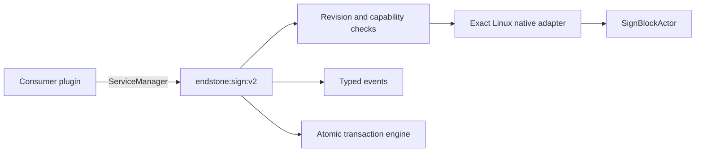

# Architecture

## Production boundary

Endstone Sign API is a headless provider plugin. It registers one service,
`endstone:sign:v2`, and does not register gameplay, player, console, or testing
commands. Consumer plugins load the service and define their own behavior.

## Portable contract

The portable C++20 layer owns value types, validation, deterministic revisions,
events, schema projection, lifecycle orchestration, and the in-memory reference
adapter. It has no Bedrock ABI dependency and is exercised on Linux and Windows.

The pure-Python package mirrors the portable data model for offline tooling,
plugin-domain logic, and contract tests. It is not a replacement for the native
live service.

## Endstone placement boundary

Placement and removal use Endstone’s public block-data APIs where possible. A
typed block identifier and state map are validated before mutation. The result
is then resolved to the exact native sign actor before text, style, editor, or
persistence work proceeds.

## Exact native adapter

Private Bedrock behavior is isolated in the guarded 26.30 adapter. The stable
Linux build requires:

- BDS package `1.26.33.1` and runtime `26.33`;
- Endstone `0.11.6`;
- the pinned `bedrock_server` SHA-256 and size;
- matching function, vtable, and representation fingerprints;
- the primary server thread;
- successful native readback after mutation.

If any identity or boundary check fails, the production service is not
registered.

## Capability and registration barrier

The adapter constructs `SignCapabilities` from the actual running environment.
The stable build reports the accepted-release capability only on its exact
supported Linux path. `completeControl()` therefore remains false for ordinary
source builds, portable builds, experimental builds, other platforms, or a
mismatched server executable.

The plugin registers `endstone:sign:v2` only when the supported exact tier is
available. Stable startup logs whether it registered the complete service.

## Revisions

Every snapshot produces a deterministic revision over structural and native
state. Consumers pass that revision back with mutations. This prevents a stale
Discord message, scheduled animation frame, shop update, or second plugin from
silently overwriting a newer player/plugin edit.

## Events

The service owns one event bus. Cancellable before-events execute before native
mutation; after-events execute only after successful mutation and verification.
Player edit interception preserves the original Bedrock call when not
cancelled. Listener IDs support deterministic unregistration during plugin
shutdown.

## Transactions and rollback

Transactions validate the complete operation list before writing. Applied
operations are recorded in a rollback ledger. On failure, existing signs are
restored from captured structural and native state, while newly created signs
are removed and verified as air. Rollback runs in reverse order.

## Distribution boundary

The stable public package contains:

- the install-ready Linux native plugin;
- public C++ headers;
- Python reference modules;
- production documentation and integration examples;
- compatibility and package manifests.

It excludes command harnesses, auxiliary diagnostic services, native test
bridges, command wheels, acceptance tools, server binaries, debug databases,
private generated headers, and decompiler output.
